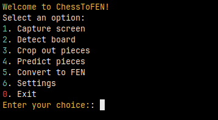
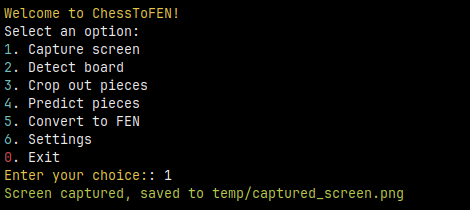
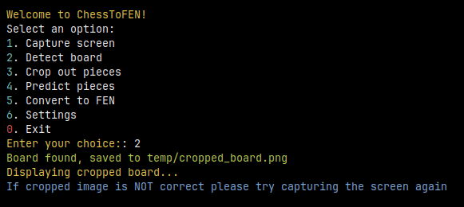
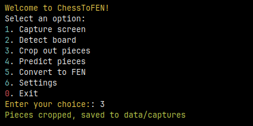
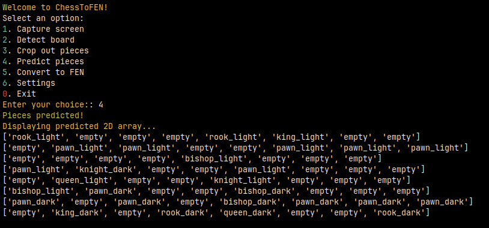
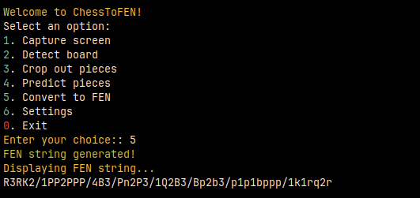

# ChessToFEN

This is a Python command-line interface (CLI) application that allows you to capture your screen, detect a chessboard, crop out the pieces, use a Convolutional Neural Network (CNN) to predict the pieces on the chessboard, and finally, predict the FEN (Forsyth–Edwards Notation) notation of the captured chessboard.

## Installation

1. Clone the repository

   ```bash
   git clone https://github.com/SimonLariz/ChessToFEN.git
   ```

2. Navigate to the directory

   ```bash
   cd ChessToFEN
   ```

3. Install the required packages
   ```bash
   pip install -r requirements.txt
   ```

## Usage

1. Run the application

   ```bash
   ./main.py
   ```

2. Select options from the menu to capture your screen, detect the chessboard, crop out the pieces, predict the pieces, and predict the FEN notation. (See screenshots below for examples)

## Convolutional Neural Network (CNN)

The CNN model used for predicting the chess pieces is trained on a labeled dataset of chess piece images. The model has been trained to recognize different chess pieces (pawn, rook, knight, bishop, queen, king) and empty squares. Please note that the model is not perfect and may make mistakes. The model is trained on a dataset of images which are located in the 'dataset' directory. The model is trained using the [PyTorch](https://pytorch.org/) library.

If you wish to train your own model, you can use the 'chessClassifier.py' script. The script will train a model on the images in the 'dataset' directory and save the model to the 'models' directory. The script will also print out the accuracy of the model on the training and validation sets.

## Screenshots








## Notes

- The application has only been tested on Linux and may not work on other operating systems.
- One may have mixed results when the chess pieces are use a different theme than the default theme.
- The application is not perfect and may make mistakes when predicting the chess pieces and FEN notation.
- The application is unable to detect whose turn it is to move and the castling rights of the players from the captured chessboard. If you wish to add this information to the FEN notation, you will have to manually add it yourself.

## License

This project is licensed under the MIT License and is free to use, modify, and distribute.

## Acknowledgements

This application was inspired by the love for chess and the desire to apply computer vision and machine learning techniques to automate chessboard analysis.

Special thanks to the developers and contributors of the libraries and tools used in this project, without which this application would not have been possible.
